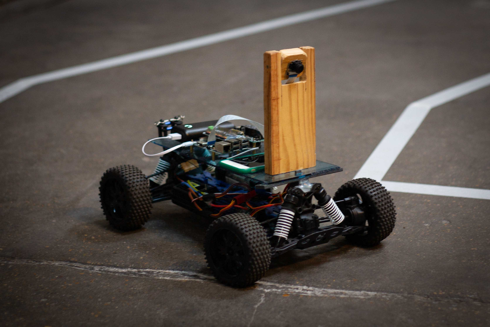
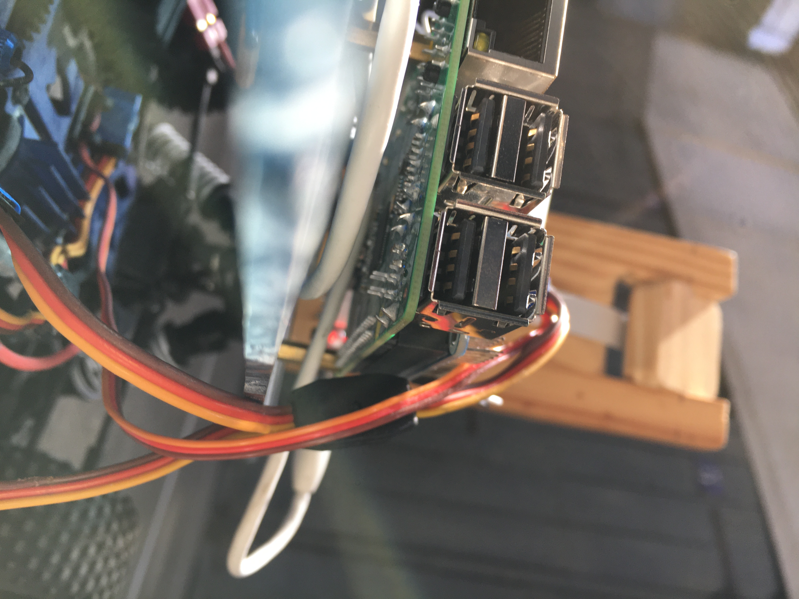

# AutonomousCar

   

I built this car for the IronCar race, where all cars are driven by artificial intelligence. It's the result of several weeks of tweaking and programming.
 

## ⚙️ hardware : 
* RaspberryPi 3b+
* RC car (T2M Pirate Shooter)
* PiCamera (wide angle)
* RaspberryPi PWM shield
* some voltage regulators
* wifi dongle
* 2x batteries
* relay module as an emergency stop
    

## 💿 software :
The car's on-board computer is in charge of processing the images in order to predict the orientation of the wheels, to correct the trajectory. This analysis is done by a combination of convolutional and sequential neural networks. These networks predict a direction according to the input image, processed by algorithms in charge of transforming the flow of the camera into data adapted for the network. The other on-board computer (it was an Arduino at first but it has been replaced by a PWM shield for the pi) is in charge of retrieving the predictions of the network and transmitting them to the different engines.
