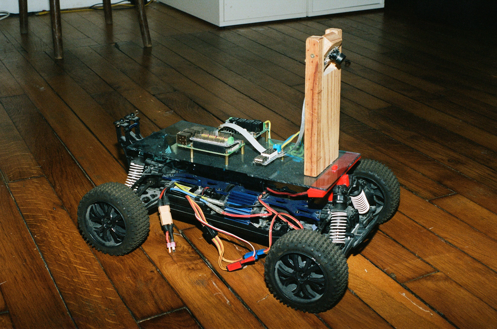

# AutonomousCar

I equipped this model car with an autonomous steering system for the [IronCar](https://twitter.com/ironcarfrance) race, in which each car had to complete 3 timed laps.

## Hardware : 
* RaspberryPi 3b+
* RC car (T2M Pirate Shooter)
* PiCamera (wide angle)
* RaspberryPi PWM shield
* some voltage regulators
* wifi dongle
* relay module as an emergency stop

## Software :
The car's onboard computer processes the camera feed and continuously adjusts the wheel angle to keep the car on track.
It uses a combination of convolutional and sequential neural networks.
I experimented with some data augmentation techniques such as adding artificial shadows to the images, and mirroring them.

The other on-board computer (it was an Arduino at first but it has been replaced by a PWM shield) is in charge of retrieving the predictions transmitting the corrected angle to the motors.

